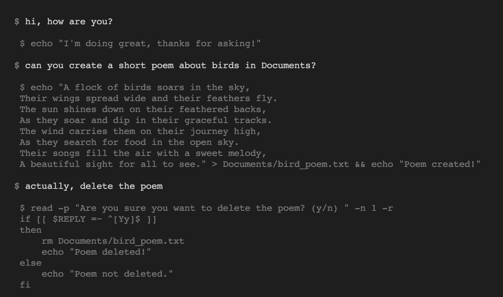

```
             _     
  __ _  ___ | |__    GSH Shell
 / _` |/ __|| '_ \ 
| (_| |\__ \| | | |  🇺🇸  Built by GPT Labs
 \__, ||___/|_| |_|  (c) 2022 GPT Labs License
 |___/
 
```

### A natural language shell for Bash and Powershell.

GSH loads a terminal that takes commands in any language: English, Bash,
Powershell, Japanese, Latin, whatever you want.

It converses with you by printing to stdout and taking the actions you ask for
by calling commands.



### Refuses to destroy data without confirmation.

As a security and safety precaution, GSH is designed to prompt before
potentially destroying data.


## Reporting bugs

Please reach out to [@gptlabs](https://twitter.com/gptlabs) on Twitter.